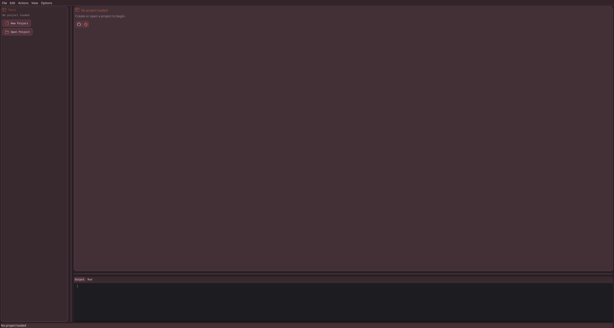
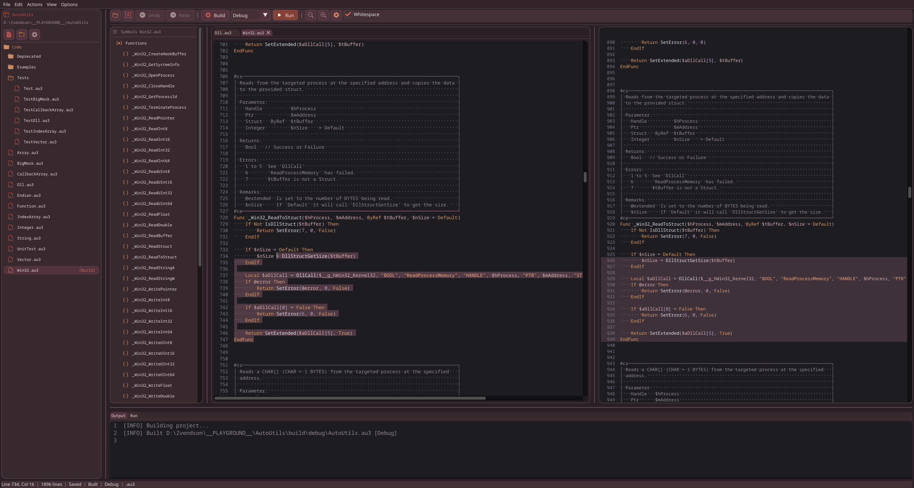
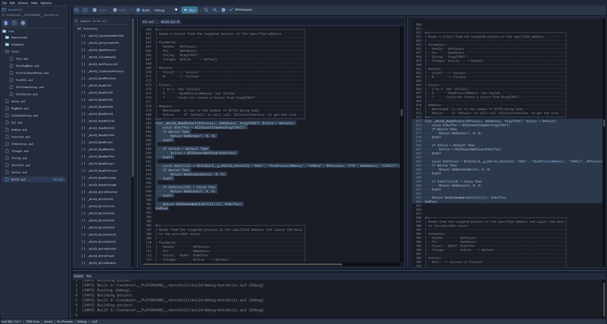

# Torii

Torii is an AutoIt+ workspace built around two parts:

- `Torii`: the language toolchain for tokenizing, expanding includes, and compiling AutoIt+ into plain AutoIt.
- `Torii Labs`: the desktop editor for working with `.torii` projects, browsing source trees, building targets, previewing generated output, and running builds from one UI.

The repository is split into a root editor app and language-specific toolchains:

- `Torii.Labs`: desktop editor
- `toolchains/AutoIt+.Common`: shared data types
- `toolchains/AutoIt+.Lexer`: tokenizer library
- `toolchains/AutoIt+.Compiler`: include resolver, custom token rewriter, and emitter
- `toolchains/AutoIt+.Cli`: command-line frontend

## Torii Labs

Torii Labs is the main user-facing application in this repo. It is a native desktop editor built with GLFW, OpenGL, and ImGui, focused on AutoIt and AutoIt+ workflows.

Key editor capabilities:

- Torii project support through `.torii` files
- syntax-highlighted source editing for AutoIt and AutoIt+
- generated AutoIt preview with source-to-preview highlighting
- source tree drag and drop, build target selection, and project settings
- symbols/outlines for functions, globals, constants, and includes
- themed shell and editor palettes, including bundled presets like `Torii` and `Umi`
- output and run consoles with ANSI color support
- configurable shortcuts and JSON-based user/workspace settings

## Screenshots

### Workspace Overview


### Empty Workspace



### Project Opened



### Umi Theme



## How To Build

### Requirements

- Windows
- CMake 3.20 or newer
- Visual Studio 2022 with MSVC C++ tools

### Configure

```powershell
cmake -S . -B build -G "Visual Studio 17 2022" -A x64
```

If `deps/` is missing, CMake downloads the editor dependencies (`glfw` and `imgui`) automatically during configure via `FetchContent`.

If you want to allow only local or vendored dependencies, configure with:

```powershell
cmake -S . -B build -G "Visual Studio 17 2022" -A x64 -DAUTOIT_FETCH_EDITOR_DEPS=OFF
```

### Build Release

```powershell
cmake --build build --config Release
```

### Build Debug

```powershell
cmake --build build --config Debug
```

### Output Paths

- Editor: `bin/Release/ToriiLabs/ToriiLabs.exe`
- CLI: `bin/Release/AutoItPreprocessor/AutoItPreprocessor.exe`

## Running Torii Labs

```powershell
.\bin\Release\ToriiLabs\ToriiLabs.exe
```

Current editor version: `0.0.1 Alpha`

## CLI Usage

### Tokenize

```powershell
.\bin\Release\AutoItPreprocessor\AutoItPreprocessor.exe tokenize .\tests\data\root.au3
```

With include directories:

```powershell
.\bin\Release\AutoItPreprocessor\AutoItPreprocessor.exe tokenize .\tests\data\root.au3 --include-dir .\tests\data\includes
```

### Strip

The `strip` command loads all includes recursively, inserts each file at most once, and writes one large AutoIt file. Without `--out`, it automatically creates `<filename>_stripped.au3`.

```powershell
.\bin\Release\AutoItPreprocessor\AutoItPreprocessor.exe strip .\tests\data\root.au3 --include-dir .\tests\data\includes
```

### Compile

The `compile` command expands includes recursively, replaces optional custom tokens, and writes valid AutoIt code again:

```powershell
.\bin\Release\AutoItPreprocessor\AutoItPreprocessor.exe compile .\tests\data\root.au3 --out .\build\compiled.au3 --include-dir .\tests\data\includes --custom .\tests\data\custom.tokens
```

Important behavior:

- includes are inserted globally only once
- `#include-once` stays compatible, but is largely redundant in the toolchain
- on Windows, `#include <file>` also searches the AutoIt registry include paths

## Default Editor Shortcuts

- `Ctrl+S`: save
- `Ctrl+Shift+S`: save all
- `Ctrl+B`: build
- `F5`: run
- `Ctrl+Z`: undo
- `Ctrl+Y`: redo

## Custom Tokens

Custom tokens are defined through external rule files:

```text
token AppMessage
match=__APP_MESSAGE__
emit=$LOCAL_VALUE & " / " & $SHARED_VALUE
kinds=Word
end
```

Exact matches on individual tokens are currently supported. `emit` accepts `\n`, `\t`, `\r`, and `\\` as escapes.
